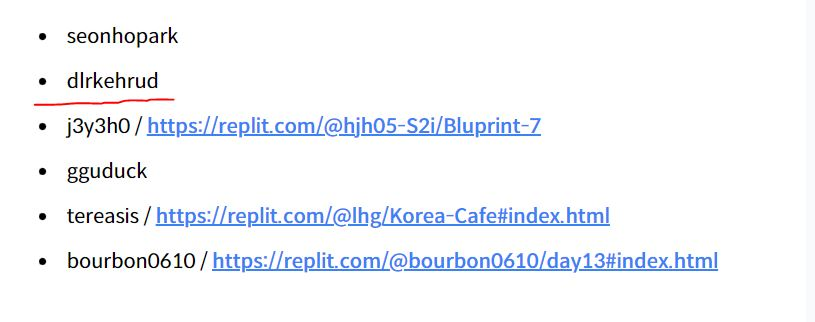

css master
1. https://replit.com/@dlrkehrud2/ConsiderateAliceblueWatchdog-5#css/style.css
2. https://replit.com/@dlrkehrud2/BadReligion-2#css/style.css
3. https://replit.com/@dlrkehrud2/Ostrich-1#index.html
4. https://replit.com/@dlrkehrud2/Bluprint-2#index.html
5. https://replit.com/@dlrkehrud2/Bluprint-4#index.html
6. https://replit.com/@dlrkehrud2/Bluprint-7#css/font_animation.css
7. https://replit.com/@dlrkehrud2/Bluprint-14#index.html
8. https://replit.com/@dlrkehrud2/Bluprint-16#js/script.js
9. https://replit.com/@dlrkehrud2/Bluprint-18#index.html   ??? 보안 오류가 뜨는데 이유를 모르겠다.

우수 졸업생 작품 구경하기 
기간: 2022년 6월 20일 ~ 7월 4일
총 신청자: 110명
최종 졸업생: 27명
https://nomadcoders.co/community/thread/5615
우수 졸업생으로 등록이 되었네요.ㅎㅎ 졸업생 27명중 6명

